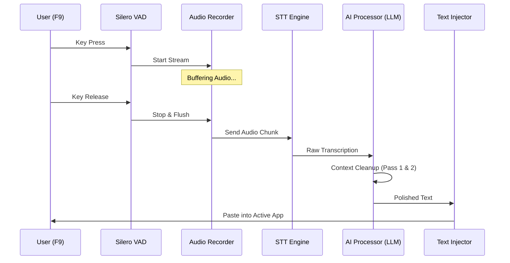

# 🎙️ Rota AI: Local-First Voice Dictation & AI Auto-Edit

<p align="center">
  
</p>

<p align="center">
  <b>The Privacy-Respecting Alternative to Wispr Flow.</b><br>
  <i>Dictate naturally. AI cleans the mess. Output stays local.</i>
</p>

<p align="center">
  
  
  
  
  
</p>

---

### 🚀 Quick Start (60 Seconds)

```bash
# 1. Clone & Enter
git clone https://github.com/krthik20050/Rota-AI.git && cd Rota-AI

# 2. Setup (Automatic)
run.bat

# 3. Dictate
# Hold F9 anywhere in Windows, speak, and release.
```

> [!TIP]
> Make sure to copy `.env.example` to `.env` and add your **Gemini** or **Groq** keys for maximum speed and intelligence. For 100% offline use, just point Rota to **Ollama**.

---

### ✨ Key Features

*   **⚡ Blazing Fast Dictation:** Powered by **Groq Whisper** and **Faster-Whisper** for near-instant results.
*   **🧹 AI Auto-Edit:** Automatically resolves stutters, "um/uh" fillers, and self-corrections (e.g., *"Wait, no, I meant..."*).
*   **🛡️ Privacy First:** API keys are encrypted via **Windows DPAPI**. Transcription history is stored locally in SQLite.
*   **📧 Context Intelligence:** Detects if you're in a Terminal, IDE, or Slack and adjusts formatting (e.g., preserving `camelCase` in code).
*   **📖 Personal Vocabulary:** Teach Rota your unique jargon, acronyms, and names.
*   **⚡ Voice Snippets:** Create custom voice-triggered text expansions.

---

### 📊 Rota AI vs. The Competition

| Feature | Wispr Flow | **Rota AI** |
| :--- | :---: | :---: |
| **Privacy** | Closed Source | **Open Source** |
| **Price** | Subscription | **Free & Local** |
| **Speed** | Fast | **Groq-Fast (Sub-500ms)** |
| **Offline Mode** | No | **Yes (Ollama)** |
| **Context Aware** | Yes | **Yes** |

---

### 💻 Tech Stack & Dependencies

| Category | Tools |
| :--- | :--- |
| **Interface** |   |
| **Speech** |   |
| **Intelligence** |   |
| **Performance** |   |

---

### 🏗️ Architecture: Real-Time Pipeline

Rota AI leverages a high-concurrency, mixin-based architecture to ensure zero-lag dictation.




---

### 🤖 Supported Models & Providers

| Task | Provider | Recommendation |
| :--- | :--- | :--- |
| **Transcription** | **Groq** | `whisper-large-v3` (Ultra-low latency) |
| **Local STT** | **Faster-Whisper** | `distil-large-v3` (Best balance of speed/accuracy) |
| **AI Cleanup** | **Gemini** | `gemini-1.5-flash` (Superior reasoning & structure) |
| **Offline LLM** | **Ollama** | `llama3:8b` or `mistral` |

---

### 📂 Repository Structure
```text
D:\PROJECTS CODES\ROTA AI
├── desktop/
│   ├── ai/            # Prompt Engineering & LLM Orchestration
│   ├── app/           # Core Controller & Thread Lifecycles
│   ├── audio/         # VAD & Hardware Recording Logic
│   ├── data/          # Local SQLite & Encrypted Config
│   ├── injection/     # Active Window Detection & Text Input
│   ├── ui/            # PySide6 Modern Dashboard & Overlays
│   └── utils/         # Performance Metrics & Logging
├── main.py            # Entry Point
└── run.bat            # Quick Launcher
```

---

### 🛠️ Configuration Reference

| Variable | Description | Provider |
| :--- | :--- | :--- |
| `GEMINI_API_KEY` | Elite intelligence & context | [Google AI Studio](https://aistudio.google.com/app/apikey) |
| `GROQ_API_KEY` | Ultra-low latency transcription | [Groq Console](https://console.groq.com/keys) |
| `OLLAMA_URL` | For 100% local LLM cleanup | [Ollama.com](https://ollama.com) |

---

### 🤝 Contributing

We are building the future of privacy-first voice interfaces.
1. Fork the Project
2. Create your Feature Branch (`git checkout -b feature/AmazingFeature`)
3. Commit your Changes (`git commit -m 'Add some AmazingFeature'`)
4. Push to the Branch (`git push origin feature/AmazingFeature`)
5. Open a Pull Request

---

### 📜 License

Distributed under the **MIT License**. See `LICENSE` for more information.

<p align="center">
  <br>
  Built with ❤️ by <b>Karthik</b> and the Rota AI Community.
</p>
