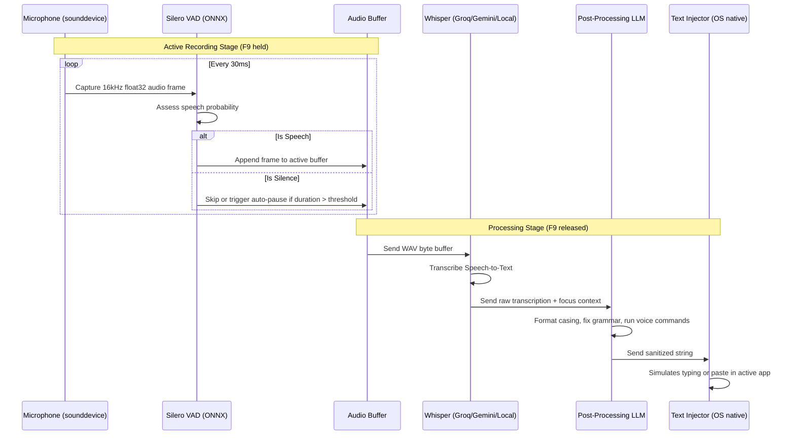

The audio pipeline handles the life cycle of voice data, transforming raw acoustic microphone signals into clean text injected directly into your focus application.

---

### Step-by-Step Execution Flow

---

### Detailed Phase Explanations

#### 1. Microphone Ingest (`audio/recorder.py`)
- Rota AI utilizes `sounddevice` (which wraps **PortAudio**) to establish an input stream.
- Audio is recorded as a single-channel (mono), 32-bit floating-point PCM stream sampled at exactly **16,000 Hz**.

#### 2. Real-Time Voice Activity Detection (`audio/vad.py`)
- Rota AI integrates **Silero VAD v6** running locally via `onnxruntime`.
- As the microphone captures audio, it is split into 30ms chunks (480 samples).
- The VAD model returns a probability score of speech. If the score peaks above the `VAD_THRESHOLD` (default: 0.5), it is flagged as active speech.
- **Padding Buffer**: 300ms of audio before and after speech chunks are preserved to avoid clipping the start or end of sentences.

#### 3. Transcription Phase (`audio/transcriber.py`)
- The compiled WAV buffer is sent to your selected backend.
- Local transcription uses `faster-whisper` (CTranslate2 framework), wrapping quantized Whisper models in 8-bit integer formats (`int8`) for GPU or CPU speed.
- Cloud backends stream raw WAV files inside multipart-form payloads.

#### 4. LLM Cleaning Pass (`ai/ai_processor.py`)
- The raw transcription is processed by an LLM cleaning prompt.
- **System Prompting**: Instructs the LLM to strip filler words ("um", "uh"), correct speech disfluencies, and format text based on the active window title.
- **Context Injection**: The prompt is updated dynamically with variables like `{window_title}` and `{app_name}` to guide the formatting engine.
