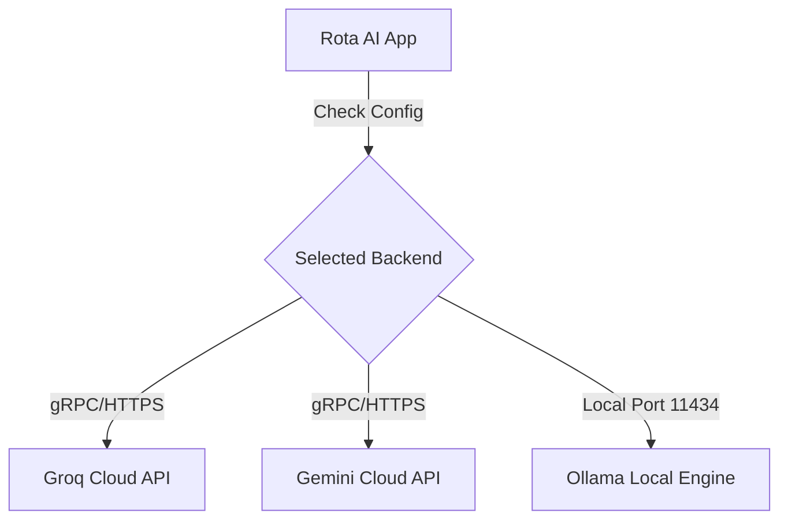

Rota AI provides modular support for cloud and local AI engines. You can configure and toggle between these backends dynamically inside the **Settings > Transcription** panel.


---

### Backend Data Routing Flow



---

### 1. Groq Cloud (Recommended for Speed)
Groq utilizes LPU (Language Processing Unit) accelerators to deliver sub-second transcription times using OpenAI's **Whisper Large v3** model.

* **Latency**: ~300ms - 600ms (depending on network speed).
* **Setup Requirements**:
  1. Register for an account at [console.groq.com](https://console.groq.com).
  2. Navigate to **API Keys** and generate a new key (`gsk_...`).
  3. Paste the key into Rota AI Settings under Groq Backend.
* **Limitations**: Subject to Groq's API rate limits (tokens-per-minute and requests-per-minute), which are generous on their free tier.

---

### 2. Gemini Cloud (Highly Accurate)
Google's Gemini speech recognition API is ideal for technical vocabulary, non-standard spelling, and non-English speakers.

* **Latency**: ~800ms - 1.5s.
* **Setup Requirements**:
  1. Visit [Google AI Studio](https://aistudio.google.com).
  2. Click **Get API Key** and generate a key for a new or existing Google Cloud project.
  3. Paste the key into Rota AI Settings under Gemini Backend.
* **Feature Set**: Gemini performs excellent multi-language auto-detection out of the box.

---

### 3. Ollama (Local & Air-Gapped)
Ollama runs transcription models locally on your system hardware. This is the ultimate option for developers processing proprietary code, sensitive emails, or working in remote environments.

* **Latency**: ~1.5s - 5.0s (highly dependent on CPU/GPU hardware).
* **Prerequisites**:
  - Install Ollama from [ollama.com](https://ollama.com).
  - Pull your preferred Whisper model from the command line:
    ```bash
    # Choose one:
    ollama pull whisper-small    # ~480MB, fast, low resource use
    ollama pull whisper-large    # ~3.1GB, highly accurate, slower
    ```
* **Integration**: Rota AI automatically detects active local Ollama instances on port `11434` and uses them to process transcription.
