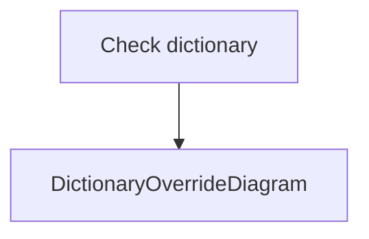
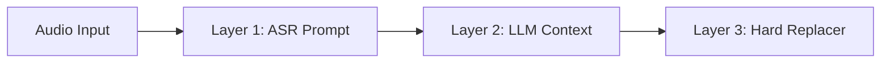

Automatic Speech Recognition (ASR) models like Whisper often struggle with industry-specific terminology, specialized API commands, brand names, or regional nouns (e.g., typing *"next JS"* instead of *"Next.js"*).

To solve this, Rota AI features a multi-tiered **Personal Dictionary** system. It guides the Whisper model's token sampling, instructs the post-processing LLM cascade, applies hard local regex replacements, and automatically learns new terms from your dictation history.

---

### System Architecture & Data Routing

The following diagram illustrates how personal terms are configured, stored in JSON format, injected into the transcription/LLM cascade, normalized, and auto-learned back into storage:

---

### Core Components

#### 1. Configuration & Storage
Your personal dictionary consists of two data sets stored in your local application directory:
- **`dictionary.json`**: Explicit word overrides and custom terminology mappings defined by you in the UI.
- **`personal_dictionary.json`**: An auto-growing vocabulary cache built dynamically by the Auto-Learning Engine.
- **Directory Paths**:
  - **Windows**: `%APPDATA%/RotaAI/`
  - **macOS**: `~/Library/Application Support/RotaAI/`
  - **Linux**: `~/.local/share/rota-ai/`

#### 2. The Auto-Learning Engine
Every time Rota AI finishes cleaning a transcript, it runs a background worker (`learn_from_text()`) to scan the polished text and extract notable terms.
- **Extraction Rules**:
  - **Proper Nouns**: Capitalized words that do not appear at the start of a sentence (e.g., `"Vercel"`, `"TypeScript"`).
  - **Acronyms**: Fully capitalized tokens of 2+ characters (e.g., `"API"`, `"JSON"`, `"ASR"`).
  - **Technical Identifiers**: Words containing underscores, dots, or camelCase/PascalCase syntax (e.g., `"main_window.py"`, `"sounddevice"`, `"rx="6""`).
- **Storage Limits**:
  - The local database caps auto-learned entries at **500 terms** to keep performance optimal.
  - When the cap is reached, Rota AI prunes the least-frequently-used terms that only have a single occurrence.

---

### Backend Data Routing Pipeline

When you press the global dictation hotkey (`F9`), Rota AI routes your vocabulary context through three distinct correction layers:

#### Layer 1: ASR Prompting (Whisper Hinting)
When recording starts, the main controller loads all manual and learned terms and serializes them into a comma-separated list. This list is passed as the `prompt` parameter to the Whisper API or local CTranslate2 model.
> [!NOTE]
> The ASR prompt guides the decoder's beam search, making the model far more likely to transcribe phonetically similar sounds as your customized terms.

#### Layer 2: LLM Post-Processing (Context Injection)
The top 50 terms are dynamically appended to the post-processing LLM system prompt under a `## PERSONAL VOCABULARY` header.
This instructs the cascade (Gemini, Groq, or Ollama) to check spelling and casing against your personal dictionary during grammar cleaning.

#### Layer 3: Local Regex Normalizer (Hard Replacements)
If the cloud model fails to correct a word, a local normalizer does a case-insensitive regex substitution sweep over the text using your explicit dictionary mappings right before typing the text into the active window.

---

### Managing Terms in the UI

1. Open Rota AI and navigate to **Settings > Dictionary**.
2. Click **Add Word** to manually register custom terms.
3. Provide:
   - **Spoken Word / Target**: How the word sounds or how Whisper usually misbehaves (e.g., `"rota ai"`, `"roll tab"`).
   - **Replacement / Preferred Casing**: The exact casing and punctuation you want typed (e.g., `"Rota AI"`).
4. Manual entries are given an immediate high weight (`+10`) in the database so they are never pruned.
