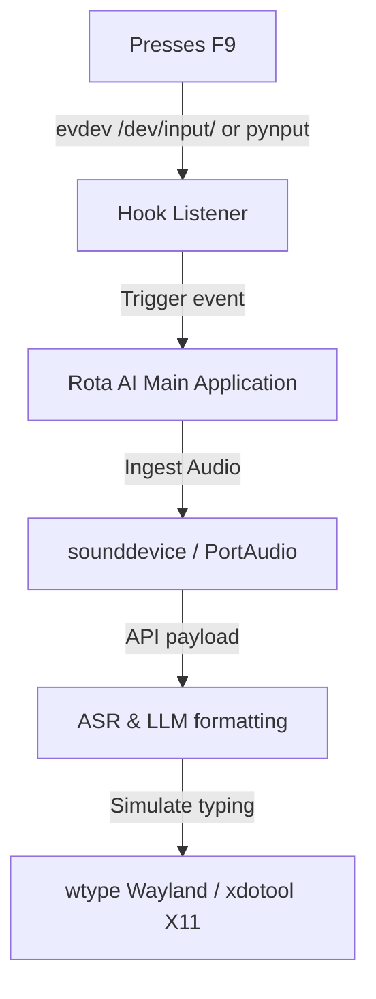

This guide covers system dependencies, hotkey listeners, text injection configuration, and troubleshooting for Rota AI on Linux.


---

### Linux Execution Flow



---

### Wayland vs X11 Display Server Setup

Linux systems use either the **X11** or **Wayland** display server protocol. Because Wayland has strict security barriers that block apps from sniffing keys or injecting text globally, setup varies by environment.

#### 1. X11 Environments (Ubuntu, Mint, Debian, etc.)
Under X11, Rota AI works out of the box:
- **Hotkey**: Listens using `pynput` via standard Xlib keyboard capture.
- **Injection**: Injects text using `xdotool` to simulate key presses or execute a virtual paste command.

#### 2. Wayland Environments (Fedora, Ubuntu 22.04+, Arch, etc.)
Under Wayland, traditional key sniffing and injection tools are blocked. Rota AI uses the following workarounds:
- **Hotkey Hook**: Listens using `/dev/input/` events via the `evdev` Python library.
  - *Note: Reading `/dev/input/` requires your user account to be a member of the `input` group.*
    ```bash
    sudo usermod -aG input $USER
    # Log out and log back in for changes to take effect.
    ```
- **Text Injection**: Rota AI utilizes `wtype` (Wayland type tool) or `dotool`. Install `wtype` via your package manager:
  ```bash
  sudo apt install wtype      # Ubuntu/Debian
  sudo dnf install wtype      # Fedora/RHEL
  sudo pacman -S wtype        # Arch Linux
  ```

---

### Keyboard Injection Fallbacks
If `wtype` is not supported on your compositor:
1. Open Rota AI **Settings > Injection**.
2. Change the method to **Clipboard Paste Fallback**.
3. Rota AI will write to the primary clipboard using `xclip` or `wl-copy` and send a virtual keypress combination.
