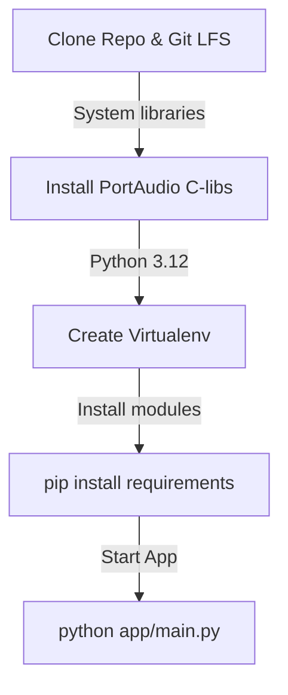

Follow these instructions to set up a Python virtual environment and run the Rota AI desktop application locally from the source files.


---

### Local Environment Setup Flow



---

### Step 1: Python Version Check
Rota AI requires **Python 3.12+**. Verify your active version:
```bash
python --version
```

---

### Step 2: System Dependency Installation

#### macOS
Install `PortAudio` (needed for recording microphone signals) and `pkg-config`:
```bash
brew install portaudio pkg-config
```

#### Linux (Debian/Ubuntu)
Install `PortAudio` headers and compilation dependencies:
```bash
sudo apt update
sudo apt install python3-dev build-essential portaudio19-dev libasound2-dev
```

#### Windows
No extra installation is required; the raw PortAudio wheels are built-in inside the Python `sounddevice` Windows binary package.

---

### Step 3: Set Up a Virtual Environment

Create and activate a Python virtual environment inside the `desktop/` directory:

```bash
# Navigate to desktop source directory
cd Rota-AI/desktop

# Create virtual environment
python -m venv .venv

# Activate - Windows (Command Prompt)
.venv\Scripts\activate.bat

# Activate - Windows (PowerShell)
.venv\Scripts\Activate.ps1

# Activate - macOS / Linux
source .venv/bin/activate
```

---

### Step 4: Install Dependencies

With the virtual environment active, install the required packages:

```bash
# Update pip to latest
python -m pip install --upgrade pip

# Install dependencies
pip install -r requirements.txt
```

---

### Step 5: Running Rota AI

Launch the desktop app using the launcher script or Python:

```bash
# Standard Python launch
python app/main.py
```

*Note: On first launch, the app will create the SQLite database `rota.db` inside your OS app-data directories and compile the default settings.*
