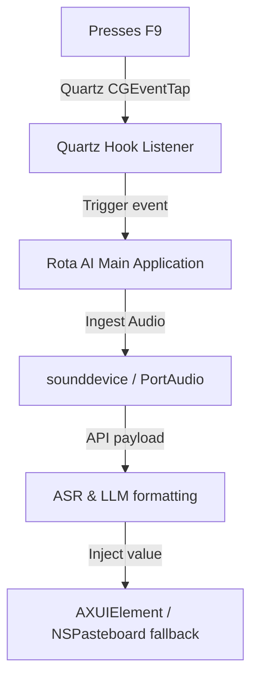

This guide covers setup, permissions, and troubleshooting for Rota AI on macOS 13 (Ventura) and macOS 14 (Sonoma).

---

### macOS Execution Flow

---

### Permissions Checklist

Because macOS implements strict sandboxing, Rota AI requires explicit OS permissions to capture keys and insert text.

#### 1. Accessibility API Access
The accessibility API is required for Rota AI to:
- Intercept the global hotkey (`F9`) in the background.
- Query the active window's identity.
- Inject text at the current text cursor.

**To Enable**:
1. When Rota AI launches, a system prompt will ask you to open System Settings.
2. Go to **System Settings > Privacy & Security > Accessibility**.
3. Locate **RotaAI** in the list and toggle the switch to **ON**.
4. If it's already ON but not working, click the minus (`-`) button to remove RotaAI, restart Rota AI, and re-enable it when prompted.

#### 2. Microphone Access
Required to capture raw audio from your selected input device.

**To Enable**:
1. Go to **System Settings > Privacy & Security > Microphone**.
2. Find **RotaAI** and ensure the toggle is active.

---

### Internal Implementation Details

#### 1. Hotkey Interception
On macOS, Rota AI binds key events using the Quartz event system:
* API: `CGEventTap` is created via Quartz framework (`CoreGraphics`).
* It captures key down and key up events globally and translates them into UI actions.

#### 2. Text Injection
macOS uses the Accessibility framework and AppleScript paste commands to inject text:
* **AXUIElement**: Rota AI tries to locate the active focused text element using accessibility reference hooks. If the element exposes writing properties, Rota writes directly to the element's value property.
* **AppleScript / NSPasteboard Fallback**: If the active application blocks accessibility inputs (like some terminal emulators), Rota copies the text to `NSPasteboard`, calls an AppleScript to execute a virtual `Cmd+V`, and restores the clipboard state.
