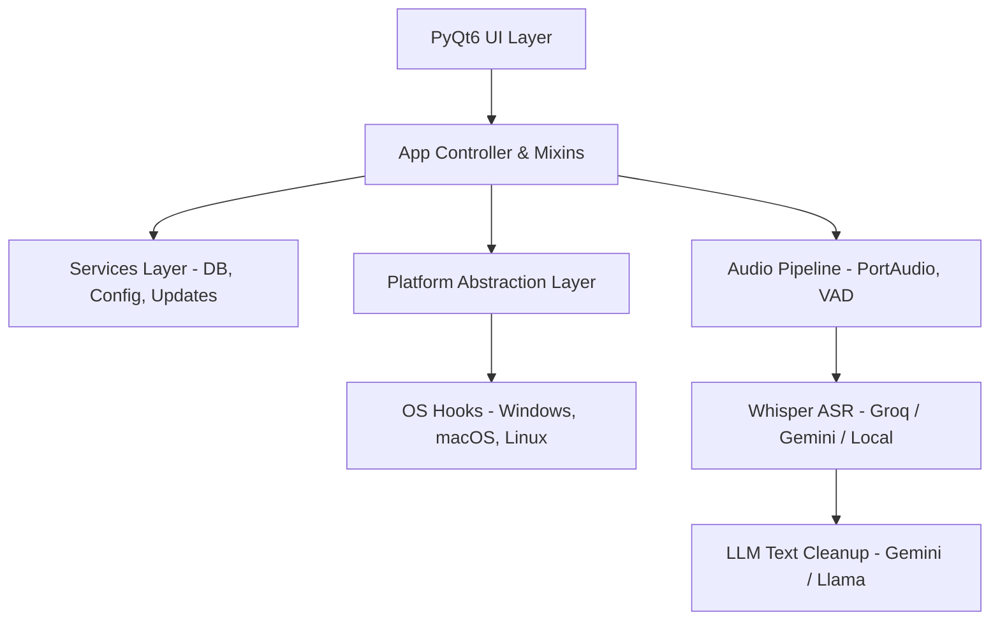

Rota AI is a cross-platform desktop voice-dictation assistant designed for speed, modularity, and privacy. The application is built using a layered architecture that decouples the UI layer from the background audio processing pipeline, platform-specific operating system hooks, and AI transcription interfaces.

### High-Level Architectural Layers

#### 1. UI Layer (`ui/`)
- Written in **PyQt6 (Qt 6 bindings for Python)**.
- Uses customized QSS (Qt Style Sheets) to render a dark-themed interface, featuring smooth transitions, window-blur effects (Windows DPAPI/acrylic), and a floating recording overlay pill.

#### 2. App Logic & Wiring (`app/`)
- Orchestrates startup health checks, database seeding, logging configurations, and single-instance locks.
- Integrates Mixins to separate concerns (e.g., `RecordingStateMixin`, `HotkeyMixin`, `TranscriberMixin`, and `ProcessingPipelineMixin`).

#### 3. Platform Abstraction Layer (`plat/`)
- Bridges OS differences. All code outside this directory is OS-agnostic.
- Employs dynamic imports to load platform-specific modules at runtime based on the target OS.

#### 4. Audio Pipeline (`audio/`)
- Interlaces audio capturing, voice activity detection, and transcription engines.

#### 5. Data & Storage Layer (`data/` / `services/`)
- Config manager handles configuration reads and writes.
- Local SQLite database caches transcription history and snippet mappings.
