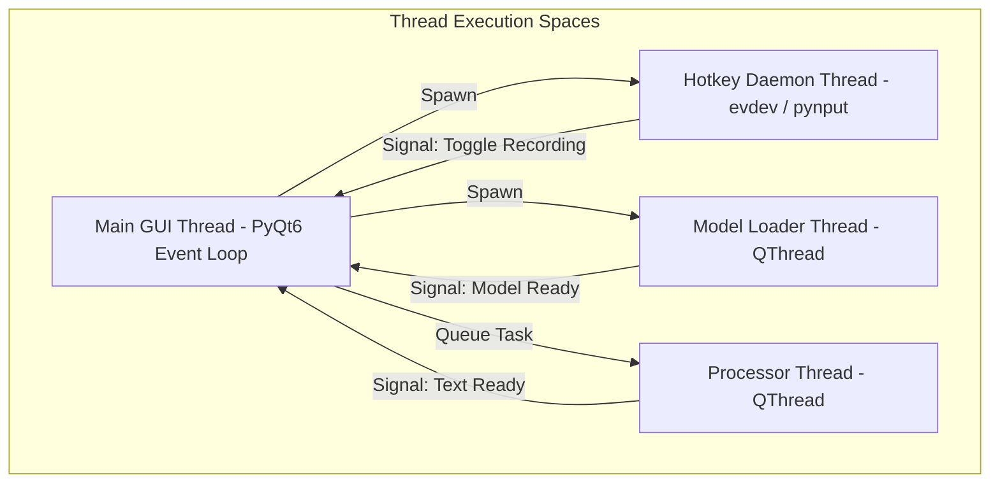

To maintain a responsive UI at 60 FPS (preventing the floating recording pill or settings window from freezing), Rota AI segregates UI operations, global keyboard listening, and deep learning transcription workloads into separate execution threads.

---

### Thread Allocations

#### 1. Main GUI Thread
* **Responsibility**: Manages the PyQt6 event loop, renders all UI components (Tray icon, Settings pages, History dashboard, Overlay recording indicator), and receives execution signals from background workers.
* **Constraint**: Must never perform blocking network requests, file reads, or AI modeling calculations. Any block > 16ms causes UI stuttering.

#### 2. Global Hotkey Listener Thread (Daemon)
* **Responsibility**: Listens for system-wide key presses (F9, Esc) globally.
* **Mechanism**: Spawned on startup as a background Python daemon thread. It runs a blocking keyboard event loop using:
  - Windows: Win32 hook thread.
  - Linux: `evdev` file reader event loop.
  - macOS: `CGEventTap` CoreGraphics listener.
* **Communication**: Emits a custom callback/signal to the Main Thread when the trigger key combination is pressed.

#### 3. Background Model Loader Thread (`QThread`)
* **Responsibility**: Preloads local Whisper models (when using Ollama or faster-whisper fallbacks) on startup.
* **Mechanism**: Implemented using PyQt's `QThread`. Once the model weights are loaded into VRAM or system memory, it emits a signal to enable local dictation mode.

#### 4. Processing Pipeline Worker Thread (`ProcessorThread`)
* **Responsibility**: Handles VAD slicing, connects to APIs, waits for LLM cleaning cycles, and executes local translation.
* **Mechanism**: A new `ProcessorThread` (subclass of `QThread`) is queued when recording stops. It executes synchronously in the background, emitting step signals (`transcribing`, `cleaning`, `finished`) back to the main thread to update the overlay pill animation.

---

### Thread Safety Rules
* **No Direct Widget Updates**: QWidgets and Qt layouts must only be modified from the Main GUI thread. Calling `.setText()`, `.show()`, or `.hide()` on a widget from inside `ProcessorThread` will trigger a segmentation fault.
* **PyQt Signals/Slots**: Thread communication is handled strictly via PyQt Signals. Qt automatically queues these signals across thread boundaries safely.
