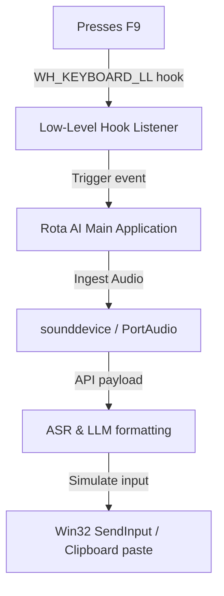

This guide details configuration, troubleshooting, and internal details for running Rota AI on Microsoft Windows 10 and 11.

---

### Windows Execution Flow

---

### Prerequisites
* Windows 10 (Build 19041+) or Windows 11.
* Microsoft Visual C++ Redistributable (normally installed automatically).

---

### Internal Hooks & Implementation Details

#### 1. Keyboard Hooks (Hotkey Listener)
On Windows, Rota AI utilizes `pynput` which hooks into the low-level Windows keyboard driver using standard Win32 hooks:
* API: `SetWindowsHookExW` with `WH_KEYBOARD_LL`.
* Because the key listener is global, it can capture key events even when Rota AI is minimized or in the background.

#### 2. Text Injection
Text injection on Windows is handles by two methods depending on text length:
* **Direct Input (SendInput)**: Simulates virtual keystrokes using `SendInput`. This sends raw virtual keycodes down the Windows message pump.
* **Clipboard Paste**: For strings larger than 200 characters, Rota AI stores the string in the Windows clipboard (`OpenClipboard` -> `SetClipboardData`), sends a virtual keyboard combo of `Ctrl+V`, and restores the original clipboard content after a brief delay.

---

### Troubleshooting Windows Quirks

#### 1. Hotkey Fails in Administrator Apps
If you focus an application running as Administrator (e.g., Command Prompt, Task Manager, or Visual Studio run as Admin), pressing `F9` may not trigger dictation, or the text might not inject.
* **Cause**: Windows User Account Control (UAC) blocks user-level processes from sending keystrokes or listening to hotkeys inside elevated windows.
* **Solution**: Right-click the Rota AI shortcut/executable and select **Run as administrator**.

#### 2. Audio Latency / PortAudio Errors
If you see logs mentioning `PortAudio error: Device unavailable` or experience crackly recording:
* Go to Windows *Settings > Sound > Properties* of your microphone.
* Ensure the **Format** is set to `16-bit, 44100 Hz` or `16-bit, 48000 Hz`.
* Disable any "Audio Enhancements" or "Spatial Sound" filters which can interfere with raw buffer capture.
